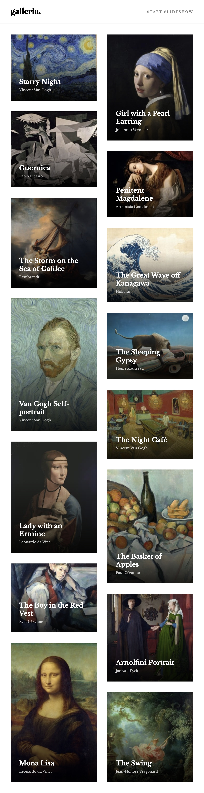
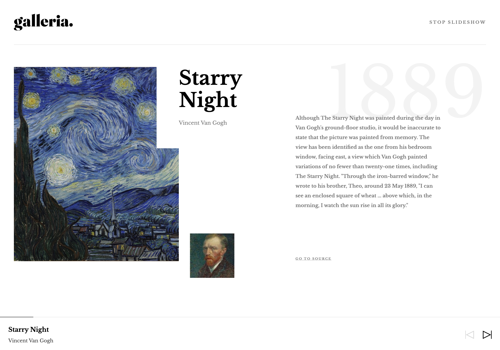
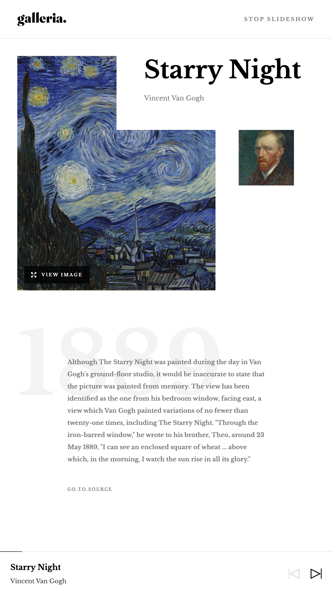
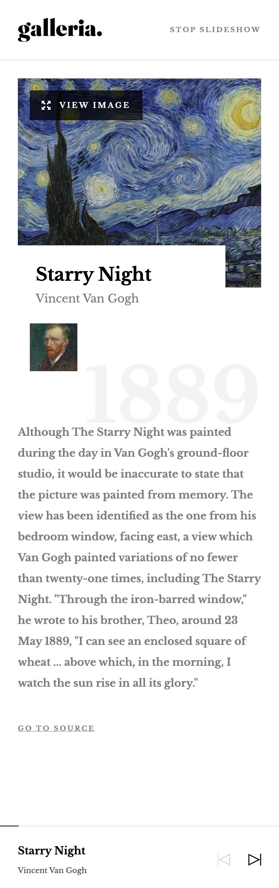

# Frontend Mentor - Galleria slideshow site solution

This is a solution to the [Galleria slideshow site challenge on Frontend Mentor](https://www.frontendmentor.io/challenges/galleria-slideshow-site-tEA4pwsa6). Frontend Mentor challenges help you improve your coding skills by building realistic projects.

## Table of contents

- [Frontend Mentor - Galleria slideshow site solution](#frontend-mentor---galleria-slideshow-site-solution)
  - [Table of contents](#table-of-contents)
  - [Overview](#overview)
    - [The challenge](#the-challenge)
    - [Keyboard Navigation](#keyboard-navigation)
    - [Screenshot](#screenshot)
    - [Links](#links)
  - [My process](#my-process)
    - [Built with](#built-with)
    - [What I learned](#what-i-learned)

## Overview

### The challenge

Users should be able to:

- View the optimal layout for the app depending on their device's screen size
- See hover states for all interactive elements on the page
- Navigate the slideshow and view each painting in a lightbox

### Keyboard Navigation

|                           Key                           | Action                 |
| :-----------------------------------------------------: | ---------------------- |
|        <kbd>n</kbd>, <kbd>N</kbd>, <kbd>→</kbd>         | Next slide             |
|        <kbd>p</kbd>, <kbd>P</kbd>, <kbd>←</kbd>         | Previous slide         |
|               <kbd>s</kbd>, <kbd>S</kbd>                | Start/Stop slideshow   |
|               <kbd>v</kbd>, <kbd>V</kbd>                | Display the lightbox   |
| <kbd>Backspace</kbd>, <kbd>Esc</kbd>, <kbd>Delete</kbd> | Turns off the lightbox |

### Screenshot

Home on Desktop

Home on Tablet

Home on Mobile

View on Desktop

View on Tablet

View on Mobile

### Links

- [Live Site URL](https://galleria-slideshow.frilly.dev/)

## My process

### Built with

- [Tailwind CSS](https://tailwindcss.com/)
- [Astro](https://astro.build/)
- [Solid.js](https://solidjs.org/)
- [Nanostores](https://github.com/nanostores/)

### What I learned

Apparently the gallery design on the first page is called a _masonry_ layout, and it's flagged as experimental on CSS grids, but not yet implemented on most browsers, yet. It has been available for quite a while on Firefox's masonry flag, and Safari Technology Preview recently, which sucks.

The other solution would be using a JS library to take care of it, you can find some libraries scattered around, some people may use flexbox columns with a fixed height, to make sure stuff overflows to the next column, etc. But this doesn't hold the same tab index, which means keyboard navigators will go down each column, before going on the next, instead of the usual row by row tabbing.

My solution was just looking at the design, and marking which painting belongs to which column, and construct 3 different views with different grid layouts across 3 types of devices. Since the columns only perfectly match at 768px width and 1440px width, any shorter or longer will break the equality so I didn't mind this. The end solution was a grid of four columns, each column being one single flexbox holding the items for that column.

My solution will definitely fail if any more paintings are added, but until masonry is implemented natively on browsers, there aren't any great ways to actually structure in that way without JavaScript.
